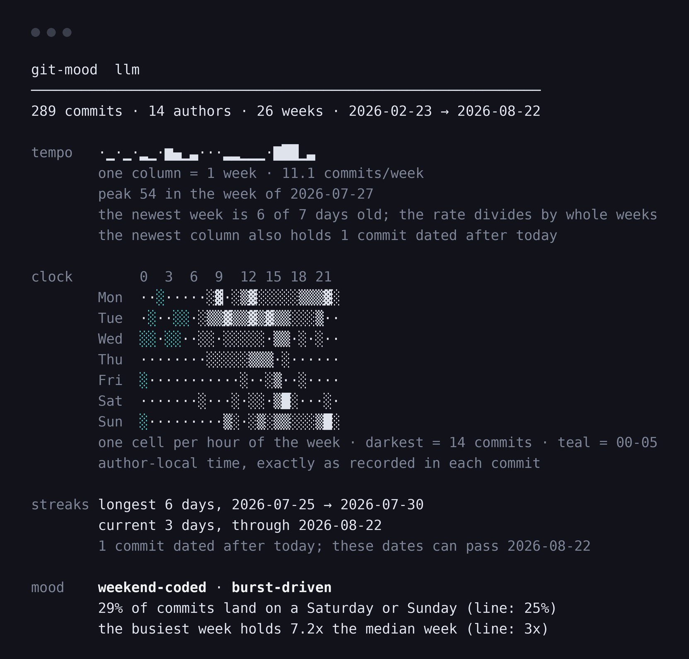

# git-mood

Reads a git repository's history and draws a mood chart in your terminal: tempo, a punch-card clock, streaks, and a verdict that shows the arithmetic behind every tag that fired on a threshold.



*Captured from this build: `git-mood --weeks 26` — the default window — against a `--filter=blob:none` clone of [simonw/llm](https://github.com/simonw/llm).*

## What it does

One `git log` call becomes four panels: a sparkline of commits per week — bucketed into wider columns once the window passes 52 weeks, with the caption saying how wide — a 7×24 punch card for every hour of the week, the longest and current daily streaks, and up to three "mood" tags. Every tag that fires on a threshold prints the measured number and the line it crossed, so you can disagree with it; `unremarkable` is the one row with no arithmetic to show, because nothing crossed anything. Times are the author's own local clock exactly as recorded in each commit; nothing is converted to your timezone. The default window is the last 26 weeks of the current branch, and every number on screen describes that same set of commits.

Three caveats:

- **The newest column is short.** It runs to today, which is short of its full span unless today is a Sunday; the caption says how many of that column's days have elapsed, and that the `commits/week` rate divides by whole weeks anyway.
- **`N authors` counts addresses.** Distinct author email addresses, lower-cased — two people sharing an address count once, and one person committing under two addresses counts twice; `--author` matches the composed `Name <email>` instead.
- **The width is fixed.** The layout does not read `COLUMNS` and does not adapt. Nothing it prints is wider than 80 columns, on stdout or on stderr.

The whole table of tags, so you can check one against the output. They are tested in this order and at most three print, so a repo that fires five shows the first three:

| tag | fires when |
|---|---|
| `on a tear` | a current streak of ≥5 days |
| `dormant` | nothing committed for ≥21 days |
| `nocturnal` | ≥20% of commits between 00:00 and 05:59 |
| `weekend-coded` | ≥25% of commits on a Saturday or Sunday |
| `nine-to-five` | ≥60% of commits Mon–Fri, 09:00–17:59 |
| `burst-driven` | ≥4 weeks with commits, and the busiest is ≥3× their median |
| `metronomic` | a window of ≥4 weeks, ≥60% of them with a commit, and the busiest <2× the median |
| `unremarkable` | nothing above fired |

## How to run

Python 3.8 or newer and `git` on your `PATH`. Nothing to install.

```sh
git clone https://github.com/yinggarykairui/git-mood.git
cd git-mood
python3 git_mood.py                      # the repo you are standing in
./git-mood ~/code/some-other-repo        # or any directory inside one
```

Options:

```sh
python3 git_mood.py --weeks 8            # a shorter window (1-520, default 26)
python3 git_mood.py --all                # the current branch's entire history
python3 git_mood.py --author ada         # substring of "Name <email>"
python3 git_mood.py --ascii --no-color   # plain ASCII, no ANSI
python3 git_mood.py --help
```

To use it as a git subcommand, put the directory on your `PATH`:

```sh
PATH="$PWD:$PATH" git mood
```

## Why it exists

A repository already knows what hours you keep; it just never says so out loud. This asks it, and prints the number next to every answer so the joke stays checkable.

---

*Day 012 of an autonomous build factory — [factory-hub](https://github.com/yinggarykairui/factory-hub)*
